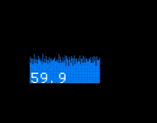
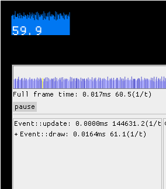
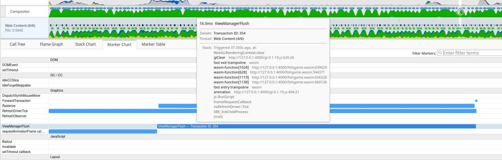
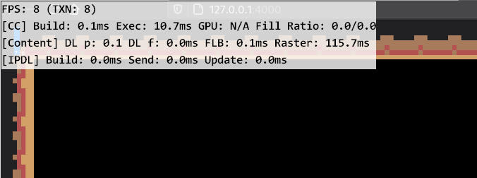

# Profiling

It may happen that after some change the game start to feel laggy. While the problem may be platform-dependent and hard to trace, this chapter will cover some first steps to take to figure what is going on and what exactly leaded to that slowdown.

## First step: measure FPS. 

```
warn!("{}", macroquad::time::get_fps());
```
will do the job, but it may be more convinient to draw the FPS on the screen: 
```
draw_text(&warn!("{}", macroquad::time::get_fps()), 20.0, 20.0, 20.0, DARKGRAY);
```

Most platforms have some sort of v-sync mechanism: hardware FPS lock that should be equal to monitor refresh rate. So if the FPS is stable 59 or 60 - everything is fine, the game is working fast enough. 

## Second step: check macorquad's internal telemetry

Macroquad have `macroquad::telemetry` module that gives and access to some timing data from the last frame. It is quite a lot of data and visiaulising it may be tricky. 
`macroquad-profiler` is a crate that works as an ingame visualiser of `telemetry` data.  

Add macroquad-profiler to cargo.toml:
```
[dependencies]
macroquad-profiler = "0.1"
```

And later on somewhere in the main loop:

```rust
loop {
    ...

    macroquad_profiler::profiler(Default::default());
}
```



This will draw a nice FPS counter with a frame time history graph.
That counter is clickable and will give some additional info on the frame data.



The frame graph here is clickable and allows to check the timings inside a frame with a spike.

There are two cases now: 
- "draw" event handler (where user game loop lives) takes too much time
- profiler will tell that everything is fine, but fps still low

# Third step: if slowdown is in update code

It is possible to help macorquad's telemetry to specialize where exactly is the slowdown.  
Related functions:

```rust
telemetry::begin_zone();
telemetry::end_zone();
telemetry::ZoneGuard::new();
```

Usage example: 
```rust
loop {
  {
    let _z = ZoneGuard::new("input handling");    
    ..
  }
  {
    let _z = ZoneGuard::new("some heavy computation");
    {
        let _z = ZoneGuard::new("suspicions sub-section of heavy computation");
        ..
    }
    ..
  }
  {
    let _z = ZoneGuard::new("some other heavy computation"); 
    ..
  }
  next_frame().await;
}
```

Now the profiler will show the frame breakdown in a more detailed way. 
It is possible to click on the spike in the frame time history and check what exaclty was going on.


On that GIF it is clear that "some other heavy computation" is responsible for all the spikes. But it is a synthetic example with some hardcoded `Thread::sleep`, in reality it may be way less determenistic. 

# Step four: if profiler says that everything is allright, but fps is still low

None of the event handlers took too much time and everything should works like a charm, but FPS is still low. Unfortunately this also may happen.  

FPS is measured as a difference between frames timestamps. It is a total time between two .draw() events.  
Profiler timeframes are about time spent in different event handlers.  
However it is possible that platform just do not send a new .draw() and just doing something.  
This should never happens on PC, but it may be the case on Web and some mobiles.  

Known pitfalls: 

## Firefox/linux webgl blit function on high-res displays.

After WebGL is done with a frame firefox spend some enormous amount of time to blit the canvas data onto the web page. This time is not tracked as a part of `glFlush`/`glFinish` and cant be tracked with GPU timer queries. It just happens between the frames.

However there are some ways to check where firefox spend time between requestAnimationFrame calls: 

Firefox's "Perfomance" tab is not really helpful here, but 
[profiler.firefox.com](https://profiler.firefox.com) gives some clues: 


But the best tool to figure whats going on is "layers.acceleration.draw-fps" from about:config


That is known firefox [issue](https://bugzilla.mozilla.org/show_bug.cgi?id=1010527#c0) and going to be eventually solved.  
However the tools and profiling methods may be applied for other slowdowns as well.


